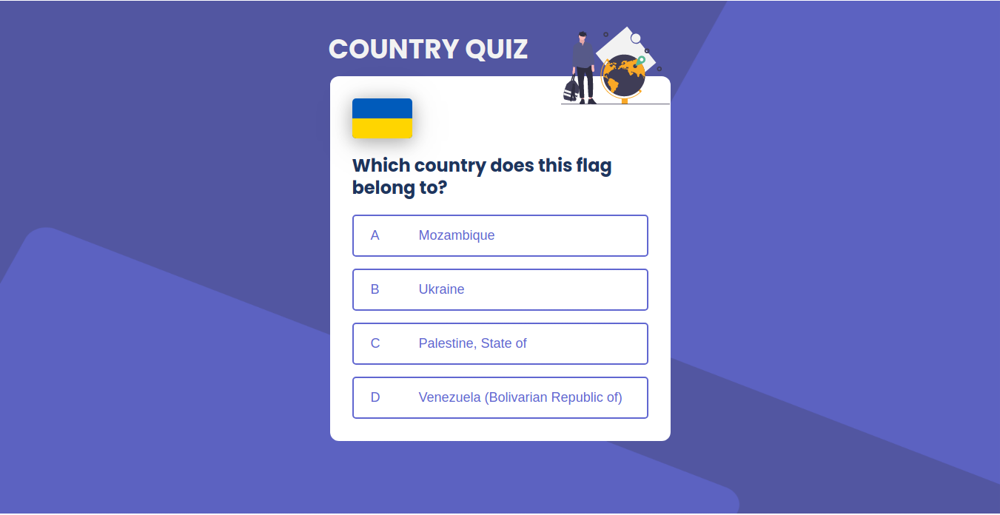
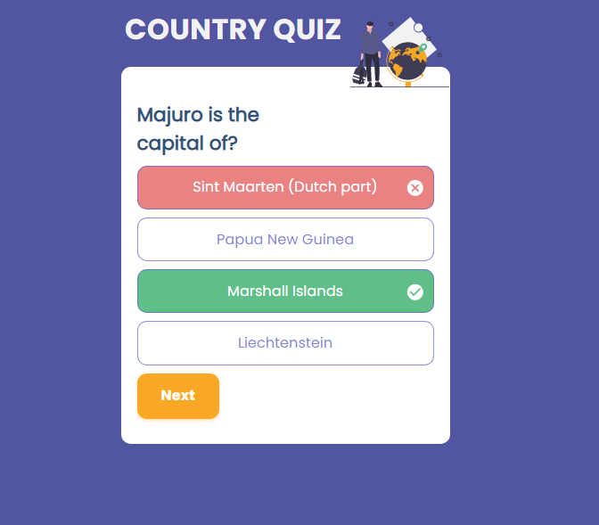
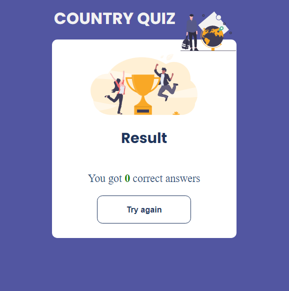
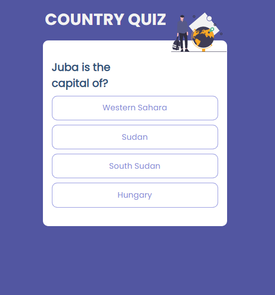

# Country Quiz

I built this app for anyone who is intersted in learning while having fun to improve your geographical knowledge.

## User stories

- There are two types of questions: A city is the capital of ..., and a flag belongs to ....
- User can select one of the options.
- If the user's answer is correct, the next question will be displayed, otherwise user can see the result and try again.

## Built With

[React](https://reactjs.org/)

## Screenshots






## How To Use

To clone and run this application, you'll need [Git](https://git-scm.com) and [Node.js](https://nodejs.org/en/download/) (which comes with [npm](http://npmjs.com)) installed on your computer. From your command line:

```bash
# Clone this repository
$ git clone https://github.com/Tanosimboangy/country_quiz

# Install dependencies
$ npm install or
$ yarn install

# Run the app
$ npm start or
$ yarn start
```

## Live app

[country_quiz]()
