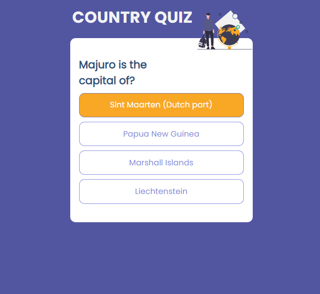

# Country Quiz

### I have built this for anyone who is intersted in learning while having fun to know all of the names of the countries around the world. If you want to challenge yourself and extend your knowledge about the world, this is the rigth path for you to take.

### You can follow the brief description about this project, in order to know about what it does, how it works, and how to use it.

### Please have a great time while playing this game. This is the link to the netlify to play it:  
## **https://country-quiz-project.netlify.app/**

<h1 align="center">Country Quiz Project</h1>

  <h3>
    <a href="https://{https://country-quiz-project.netlify.app/}">
      Demo
    </a>
     | 
    <a href="https://{https://github.com/Tanosimboangy/country-quiz}">
      Solution
    </a>
  </h3>

# *Overview:*

# *Yuo can see my demo here:*
- You can see my demo in this following link: [https://country-quiz-project.netlify.app/](https://country-quiz-project.netlify.app/).

# *My experience:*

 - Despite of the fact that I encountered a lot of struggles while creating this app, I am very proud that I could handle it.

 - Firstly, I fetched all of the data through this API [https://restcountries.eu/rest/v2/all](https://restcountries.eu/rest/v2/all). At first, I had a problem with my dependecy, because I did not have the browserslist in there, but as soon as I implemented this "browserslist" in my dependency it worked.

- Something I have never used before but I applied in this project is importing an image. Import the image as if you are to import a component so that you can use that filename inside of the source. This is quite interesting because it helps you to maintain your code clean and easily to understand.

# *Anything I have learned/improved:*

- While doing this project, I leanred: firstly, using all the ways to deal with an array, such as find(), map() and filter().

- Apart from that, I starated to fully understand more about how to use Router and and Switch, as well as Link, and how they work.

# *My wisdom:*

- In the face of bugs, I tried to do my best to fully understand what is going on before asking for help from google or anyone.

- I tried to rely on google, I did a lot of research during while fulfilling this task.

# *Contact :*

- ## Portfolio [My portfolio](https://cocky-hermann-e30656.netlify.app/)
- ## GitHub [Tanosimboangy](https://github.com/Tanosimboangy)